# Intro  

이 글은 NetVLAD의 논문과, 해당 논문을 구현한 코드를 분석하기 위해 작성한 문서입니다.   
논문 링크 : https://arxiv.org/pdf/1511.07247  
논문의 내용과 코드 실행 순서에 따라 주요 구성 및 구현 방법을 리뷰하고자 합니다.   

내용은 다음과 같이 정리합니다. 

1. 전체 Framework
2. 각 Framework의 단계별 내용과 의미와 각 언어별 구현 형태 비교

이미 pytorch에 대한 예제가 있으나, 현 시점에 맞춰 코드를 업데이트하는데 활용하고자 합니다. 


# 전체 Framework

## 1. Test  
논문에서는 VPR문제를 이미지 찾기(image retrieve) 문제로 다시 정의하고 있습니다. 어떻게 이미지를 찾아내는지의 과정을 설명합니다. Network의 형태를 정의하고, 이미지를 입력했을때, Network의 출력값이 어떻게 되는지에 대한 설명입니다.  
이후 코드를 통해 해당 부분이 어떻게 구현되었는지 확인해봅니다.   
Test는 아래와 같이 구성되어있습니다. 

    1.1. 이미지의 입력  
    1.2. CNN Network : VGG16의 conv5 사용        
    1.3. VLAD Layer
        1.3.1. VLAD Descriptor
        1.3.2. Cluster
        1.3.2. Layer Add
    1.4. 출력 Vector를 이용한 최근접 data 탐색

## 2. Training  
이미지를 찾아내는 Network를 어떻게 학습시키는지에 대한 부분을 설명합니다.  
데이터를 불러와 Dataset을 구성하는 방법에서부터, triplet의 구성과 Network의 weight를 업데이트하는 방법에 대해 설명합니다.   
이후 코드와 함께 각 단계가 어떻게 진행되는지 확인합니다.    
    
    2.1. Dataset 구성  
    2.2. Feature의 추출  
    2.3. Triplet Dataset의 구성  
    2.4. Training 시작    
        2.4.1. Subset 구성
        2.4.2. DataLoad
        2.4.3. Training
        2.4.4. Loss의 계산
        2.4.5. Backpropergation


<br>  
<br>  
<br>  
<br>  
<br>  

# Test 
Test과정은 이미지를 입력했을때, CNN Network 와 VLAD Layer를 거쳐 1차원 VLAD Vector로 출력하는 과정이다.   
이 과정을 거쳐 나온 Vector를 DB Image들과 비교하여 최근접점을 찾아내, 그 이미지의 Index값을 받으면, 입력이미지가 어떤 좌표 근처에 있음을 알 수 있게 해준다. 


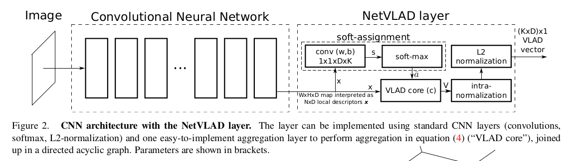

>  - Idea  
> 여기선 최근접점만 찾도록 되어있으나, 근접점 3개만 찾아도 3각측량이 가능한 것 아닐까 하는 생각은 해본다. 


<br>  
<br>  


## 1. 이미지 입력

이미지의 입력은 일반적인 DeepLearning의 규칙을 따른다. 정확히 말하면 PyTorch의 방식을 따른다. 


<div style="display:flex; gap:1rem; align-items:flex-start;">
  <div style="flex:1; min-width:0;">
    <strong>Python</strong>

main.py에서 dataset을 선택한다. epoch는 1번임을 기억하자. 
```python 
def test(eval_set, epoch=0, write_tboard=False):
     test_data_loader = 
          DataLoader(dataset=eval_set, 
                     num_workers=opt.threads, 
                     batch_size=opt.cacheBatchSize, 
                     shuffle=False, 
                     pin_memory=cuda
                    )  

# __main__ 에서의 해당위치 
if opt.dataset.lower() == 'pittsburgh':
    import pittsburgh as dataset

if opt.split.lower() == 'test':
    whole_test_set = dataset.get_whole_test_set()

if opt.mode.lower() == 'test':
    print('===> Running evaluation step')
    epoch = 1
    recalls = test(whole_test_set, epoch, write_tboard=False)
    ...... (이하 생략)


```  
 </div>
   <div style="flex:1; min-width:0;"> <strong>MATLAB</strong>

demo.m에서 
```
dbTest= dbPitts(doPitts250k, 'test');
```

dbPitts.m에서 상세 데이터들을 불러온다. 
```
methods

function db= dbPitts(fullSize, whichSet)
    % fullSize is: true or false
    % whichSet is one of: train, val, test
        
    assert( ismember(whichSet, {'train', 'val', 'test'}) );
        
    if fullSize
        sizeSuffix= '250k';
    else
        sizeSuffix= '30k';
    end
        
    db.name= sprintf('pitts%s_%s', sizeSuffix, whichSet);
        
    paths= localPaths();
    dbRoot= paths.dsetRootPitts;
    db.dbPath= [dbRoot, 'images/'];
    db.qPath= [dbRoot, 'queries/'];
        
    db.dbLoad();
end
        
  ```


   </div>
 </div>


데이터셋의 Specification은 다음과 같이 찾을 수 있다. 


<div style="display:flex; gap:1rem; align-items:flex-start;">
  <div style="flex:1; min-width:0;">
    <strong>Python</strong>

main.py에서 
```python 
class WholeDatasetFromStruct(data.Dataset):
    def __init__(self, structFile, input_transform=None, onlyDB=False):
        super().__init__()

        self.input_transform = input_transform

        self.dbStruct = parse_dbStruct(structFile)
        self.images = [join(root_dir, dbIm) for dbIm in self.dbStruct.dbImage]
        if not onlyDB:
            self.images += [join(queries_dir, qIm) for qIm in self.dbStruct.qImage]

        self.whichSet = self.dbStruct.whichSet
        self.dataset = self.dbStruct.dataset

        self.positives = None
        self.distances = None

    def __getitem__(self, index):
        img = Image.open(self.images[index])

        if self.input_transform:
            img = self.input_transform(img)

        return img, index

    def __len__(self):
        return len(self.images)

    def getPositives(self):
        # positives for evaluation are those within trivial threshold range
        #fit NN to find them, search by radius
        if  self.positives is None:
            knn = NearestNeighbors(n_jobs=-1)
            knn.fit(self.dbStruct.utmDb)

            self.distances, self.positives = knn.radius_neighbors(self.dbStruct.utmQ,
                    radius=self.dbStruct.posDistThr)

        return self.positives
        

```  
 </div>
   <div style="flex:1; min-width:0;"> <strong>MATLAB</strong>

demo.m에서 
```
classdef dbBase < handle
    
properties
    name
    whichSet
    
    dbPath, dbImageFns, utmDb
    qPath, qImageFns, utmQ
    numImages, numQueries
    
    posDistThr, posDistSqThr
    nonTrivPosDistSqThr
    
    cp
end

methods

function dbLoad(db)
    
% load custom information

paths= localPaths();
dbFn= sprintf('%s/%s.mat', paths.dsetSpecDir, db.name);

if exist(dbFn, 'file')
    load(dbFn, 'dbStruct');
    for propName= fieldnames(dbStruct)'
        if ~ismember(propName{1}, {'cp'})
            db.(propName{1})= dbStruct.(propName{1});
        end
    end
    clear dbStruct propName;
else
    error('Download the database file (%s.mat) and set the correct dsetSpecDir in localPaths.m', db.name);
end
    
% generate other useful data

db.cp= closePosition(db.utmDb, db.posDistThr);
db.numImages= length(db.dbImageFns);
db.numQueries= length(db.qImageFns);
assert( size(db.utmDb, 2) == db.numImages );
assert( size(db.utmQ, 2) == db.numQueries );
db.posDistSqThr= db.posDistThr^2;

% make paths absolute just in case (e.g. vl_imreadjpeg needs absolute path)

for propName= properties(db)'
    s= db.(propName{1});
    if isstr(s)
        db.(propName{1})= relja_expandUser(s);
    end
end
    
end

function isP= isPosQ(db, iQuery, iDb)
    isP= db.cp.isPos( db.utmQ(:,iQuery), iDb );
end

function isP= isPosDb(db, iDbQuery, iDb)
    isP= db.cp.isPos( db.utmDb(:,iDbQuery), iDb );
end

function posIDs= posDb(db, iDb)
    posIDs= db.cp.getPosDbIDs(iDb);
end

function negIDs= sampleNegsQ(db, iQuery, n)
    negIDs= db.sampleNegs(db.utmQ(:,iQuery), n);
end

function negIDs= sampleNegsDb(db, iDb, n)
    negIDs= db.sampleNegs(db.utmDb(:,iDb), n);
end

function negIDs= sampleNegs(db, utm, n)
    negIDs= [];
    
    while length(negIDs) < n
        negs= randsample(db.numImages, round(n*1.1));
        
        isNeg= ~db.cp.isPos(utm, negs);
        nNewNeg= sum(isNeg);
        
        if nNewNeg>0
            negIDs= unique([negIDs; negs(isNeg)]);
        end
    end
    
    if length(negIDs) > n
        negIDs= randsample(negIDs, n);
    end
    
end

function posIDs= nontrivialPosQ(db, iQuery)
    [posIDs, dSq]= db.cp.getPosIDs(db.utmQ(:,iQuery));
    posIDs= posIDs(dSq>1 & dSq<=db.nonTrivPosDistSqThr );
end

function posIDs= nontrivialPosDb(db, iDb)
    [posIDs, dSq]= db.cp.getPosDbIDs(iDb);
    posIDs= posIDs(dSq>1 & dSq<=db.nonTrivPosDistSqThr );
end
end
```

   </div>
 </div>


    

## 2. Convoltuion Neural Netrowk 

<figure style="text-align:center;"> 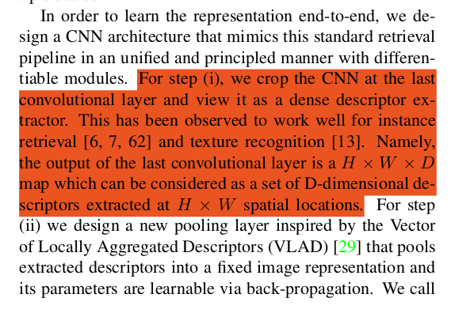</figure>

Image로 부터 Feature Vector를 추출하는 과정에서 
Test 부분의 코드 전체는 다음과 같다. 논문에서는 AlexNet과 VGG-16을 VLAD Layer와 Maxpooling과 각각 연결하여 성능을 확인했다고 하고 있으나, 배포코드에서는 최종적으로 VGG16+VLAD Layer를 사용했다.  

<figure style="text-align:center;"> 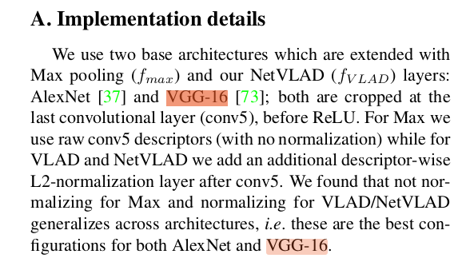</figure>


<div style="display:flex; gap:1rem; align-items:flex-start;">
  <div style="flex:1; min-width:0;">
    <strong>Python</strong>

main.py에서 test를 정의하는 부분에서 네트워크 구성을 볼 수 있다. 
dataset을 input으로 받아 encoder+vlad_encoding으로 구성하는데, 이때 앞부분의 encoder가 Pre-trained 된 CNN에 해당한다. 

```python 
def test(eval_set, epoch=0, write_tboard=False):
......(중략, 데이터로드부분)
    model.eval()

    with torch.no_grad():
            print('====> Extracting Features')
            pool_size = encoder_dim
            if opt.pooling.lower() == 'netvlad': 
                pool_size *= opt.num_clusters
            dbFeat = np.empty((len(eval_set), pool_size))

            for iteration, (input, indices) 
              in enumerate(test_data_loader, 1):
                input = input.to(device)

                image_encoding = model.encoder(input)
                vlad_encoding = model.pool(image_encoding) 

                dbFeat[indices.detach().numpy(), :] = 
                  vlad_encoding.detach().cpu().numpy()

                if iteration % 50 == 0 or 
                    len(test_data_loader) <= 10:

                    print("==> Batch ({}/{})" 
                    .format(iteration,len(test_data_loader)),
                     flush=True)

                del input, image_encoding, vlad_encoding
        del test_data_loader


```  
main.py에서 Network를 설정하는 부분

```python
print('===> Building model')

    pretrained = not opt.fromscratch
    if opt.arch.lower() == 'alexnet':
        encoder_dim = 256
        encoder = models.alexnet(pretrained=pretrained)
        # capture only features and remove last relu and maxpool
        layers = list(encoder.features.children())[:-2]

        if pretrained:
            # if using pretrained only train conv5
            for l in layers[:-1]:
                for p in l.parameters():
                    p.requires_grad = False

    elif opt.arch.lower() == 'vgg16':
        encoder_dim = 512
        encoder = models.vgg16(pretrained=pretrained)
        # capture only feature part and remove last relu and maxpool
        layers = list(encoder.features.children())[:-2]

        if pretrained:
            # if using pretrained then only train conv5_1, conv5_2, and conv5_3
            for l in layers[:-5]: 
                for p in l.parameters():
                    p.requires_grad = False

    if opt.mode.lower() == 'cluster' and not opt.vladv2:
        layers.append(L2Norm())

    encoder = nn.Sequential(*layers)
    model = nn.Module() 
    model.add_module('encoder', encoder)

```


 </div>
   <div style="flex:1; min-width:0;"> <strong>MATLAB</strong>

netPrepareForTest.m에서 
```matlab
function net= netPrepareForTest(net, removeDropout, removeExtras)
    if nargin<2, removeDropout= false; end
    if nargin<3, removeExtras= false; end
    
    for iLayer= 1:length(net.layers)
        net.layers{iLayer}.precious= false;
        
        if removeExtras
            if isFieldOrProp(net.layers{iLayer}, 'momentum')
                net.layers{iLayer}.momentum= [];
            end
        end
    end
    
    if removeDropout
        net.layers( ismember( relja_layerTypes(net), {'dropout'} ) )= [];
    end
    
end
```

testNet.m에서

```matlab
function [recall, rankloss]= testNet(db, net, opts, ID, qFeat, dbFeat)
    
    relja_display('testNet: %s %s', opts.sessionID, ID);
    
    rankloss= testCoreRank(db, qFeat, dbFeat, opts.margin, opts.nNegChoice, 'nTestSample', opts.nTestRankSample);
    recall= testCore(db, qFeat, dbFeat, 'nTestSample', opts.nTestSample, 'recallNs', opts.recallNs);
end
```
알고리즘 수행 초기에 feature데이터가 없다. 
이때 trainweekly를 수행하게되면 serialAllFeats 를 통해 network연산을 진행하게 된다. 

serialAllFeats.m파일 내부
```matlab
function serialAllFeats(net, imPath, imageFns, outFn, varargin)
    
    opts= struct(...
        'useGPU', true, ...
        'numThreads', 12, ...
        'batchSize', 10 ...
        );
    opts= vl_argparse(opts, varargin);
    simpleNnOpts= {'conserveMemory', true, 'mode', 'test'};
    
    relja_display('serialAllFeats: Start');
    
    net= netPrepareForTest(net);
```

trainweakly.m 내부
```matlab

    % --- Prepare for train
    net= netPrepareForTrain(net, opts.backPropToLayer);
    
    if opts.useGPU
        net= relja_simplenn_move(net, 'gpu');
    end
    
    nBatches= floor( dbTrain.numQueries / opts.batchSize ); % some might be cut, no biggie
    batchSaveFrequency= ceil(opts.saveFrequency/opts.batchSize);
    batchCompFeatsFrequency= ceil(opts.compFeatsFrequency/opts.batchSize);
    
    
    
    % ----- Initial features
    
    if ~exist(opts.qCheckpoint0, 'file')
        serialAllFeats(net, dbTrain.qPath, dbTrain.qImageFns, ...
            opts.qCheckpoint0, 'useGPU', opts.useGPU, 'batchSize', opts.computeBatchSize);
    end

    ...(중략)....
    qFeat= fread( fopen(opts.qCheckpoint0, 'rb'), inf, 'float32=>single');
    qFeat= reshape(qFeat, [], dbTrain.numQueries);
    nDims= size(qFeat, 1);
    dbFeat= fread( fopen(opts.dbCheckpoint0, 'rb'), [nDims, dbTrain.numImages], 'float32=>single');
    
    
    assert( relja_netOutputDim(net)==nDims );
```

demo.m에서 network의 형태를 어떻게 Session ID로 선언하고 진행하는지 알 수 있다. 

```matlab
sessionID= trainWeakly(dbTrain, dbVal, ...
    'netID', 'vd16', 'layerName', 'conv5_3', 'backPropToLayer', 'conv5_1', ...
    'method', 'max', ...
    'learningRate', lr, ...
    'doDraw', true);
    
dbTrain= dbPitts(false, 'train'); 
opts.netID= 'vd16'; 
opts.layerName= 'conv5_3'; 
opts.method= 'vlad_preL2_intra'; 
net= loadNet(opts.netID, opts.layerName); % load the network and crop at desired layer
net= addLayers(net, opts, dbTrain); % add the NetVLAD/Max/Avg layer
net= addPCA(net, dbTrain, 'doWhite', true, 'pcaDim', 4096, 'batchSize', 10); % add whitening (for non-vlad methods pick a smaller pcaDim value)
```

이제 loadNet.m으로 가보자. `net = loadNet(......)`을 어떻게 핸들링하는가는 다음 코드에서 볼 수 있다.   

imagenet-vgg-verydeep-16.mat 이 네트워크가 정의된 파일이며, 
```matlab
function net= loadNet(netID, layerName)
    if nargin<2, layerName= '_relja_none_'; end
    
    switch netID
        case 'vd16'
            netname= 'imagenet-vgg-verydeep-16.mat';
        case 'vd19'
            netname= 'imagenet-vgg-verydeep-19.mat';
        case 'caffe'
            netname= 'imagenet-caffe-ref.mat';
        case 'places'
            netname= 'places-caffe.mat';
        otherwise
            error( 'Unknown network ID', netID );
    end
    
    paths= localPaths();
    net= load( fullfile(paths.pretrainedCNNs, netname));
    
    net= vl_simplenn_tidy(net); % matconvnet beta17 or newer is needed
    
    if isfield(net.meta, 'classes')
        net.meta= rmfield(net.meta, 'classes');
    end
    
    if ~strcmp(layerName, '_relja_none_')
        net= relja_cropToLayer(net, layerName);
        layerNameStr= ['_', layerName];
    else
        layerNameStr= '';
    end
    net= relja_swapLayersForEfficiency(net);
    
    net.meta.netID= netID;
    
    net.meta.sessionID= sprintf('%s_offtheshelf%s', netID, layerNameStr);
    net.meta.epoch= 0;
    
end


```

   </div>
 </div>

- `model.eval()` 학습을 안하겠다고 설정함. Dropout과 BatchNorm이 비활성화됨. 
- `input = input.to(device)` test_dataloader에서 input을 받아 CUDA로 옮김
- `image_encoding = model.encoder(input)` 입력 이미지를 conv_feature map으로 변환  
   결과가 궁금하면 image_encodeing.shape을 출력해보면 된다. 

- `vlad_encoding = model.pool(image_encoding)` local desciptor들을 하나의 global VLAD Vector로 압축.
- `encoder_dim` CNN 네트워크에서 출력부분의 채널수.  
AlexNet은 conv5에서 256 개의 vector가 나오고, VGG-16의 경우 512개가 나온다. 여기에 Cluster 개수를 곱하면 VLAD layer를 통과한 vector개수가 나온다. 

<figure style="text-align:center;">  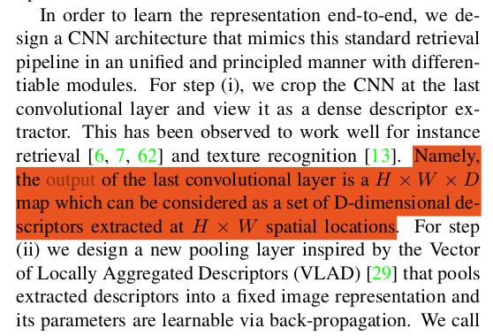</figure>

- `encoder = models.vgg16(pretrained=pretrained)` Encoder부분에 대한 선언. VGG-16모델을 사용한다. 가중치는 이미 학습된 걸 사용한다. 다만, 현재 문법은 torchvision 0.13의 문법이므로, 이후 0.25버전에 맞추려면 `encoder=models.vgg16(weights="VGG16_Weights.IMAGENET1K_V1")` 로 해야 한다. 

- `layers = list(encoder.features.children())[:-2]` encoder에 들어간 VGG-16레이어의 마지막 뒤 두개를 뺀것들을 `layer`에 저장한다. 이후 이 순서대로 `nn`에 삽입하기 위함이다. 

VGG-16 네트워크 전체를 나열해보면 다음과 같다. 
참고자료 : https://www.digitalocean.com/community/tutorials/vgg-from-scratch-pytorch


```
class VGG16(nn.Module):
    def __init__(self, num_classes=10):
        super(VGG16, self).__init__()
        self.layer1 = nn.Sequential(
            nn.Conv2d(3, 64, kernel_size=3, stride=1, padding=1),
            nn.ReLU())
        self.layer2 = nn.Sequential(
            nn.Conv2d(64, 64, kernel_size=3, stride=1, padding=1),
            nn.ReLU(), 
            nn.MaxPool2d(kernel_size = 2, stride = 2))
        self.layer3 = nn.Sequential(
            nn.Conv2d(64, 128, kernel_size=3, stride=1, padding=1),
            nn.ReLU())
        self.layer4 = nn.Sequential(
            nn.Conv2d(128, 128, kernel_size=3, stride=1, padding=1),
            nn.ReLU(),
            nn.MaxPool2d(kernel_size = 2, stride = 2))
        self.layer5 = nn.Sequential(
            nn.Conv2d(128, 256, kernel_size=3, stride=1, padding=1),
            nn.ReLU())
        self.layer6 = nn.Sequential(
            nn.Conv2d(256, 256, kernel_size=3, stride=1, padding=1),
            nn.ReLU())
        self.layer7 = nn.Sequential(
            nn.Conv2d(256, 256, kernel_size=3, stride=1, padding=1),
            nn.ReLU(),
            nn.MaxPool2d(kernel_size = 2, stride = 2))
        self.layer8 = nn.Sequential(
            nn.Conv2d(256, 512, kernel_size=3, stride=1, padding=1),
            nn.ReLU())
        self.layer9 = nn.Sequential(
            nn.Conv2d(512, 512, kernel_size=3, stride=1, padding=1),
            nn.ReLU())
        self.layer10 = nn.Sequential(
            nn.Conv2d(512, 512, kernel_size=3, stride=1, padding=1),
            nn.ReLU(),
            nn.MaxPool2d(kernel_size = 2, stride = 2))
        self.layer11 = nn.Sequential(
            nn.Conv2d(512, 512, kernel_size=3, stride=1, padding=1),#[-1]
            nn.ReLU())#[-2]
        self.layer12 = nn.Sequential(
            nn.Conv2d(512, 512, kernel_size=3, stride=1, padding=1), #[-3]
            nn.ReLU()) #[-4]
        self.layer13 = nn.Sequential(
            nn.Conv2d(512, 512, kernel_size=3, stride=1, padding=1), # [-5]
        #    nn.ReLU(),  #children[:-2] 로 삭제됨. 
        #    nn.MaxPool2d(kernel_size = 2, stride = 2))
        
        # self.fc = nn.Sequential(
        #     nn.Dropout(0.5),
        #     nn.Linear(7*7*512, 4096),
        #     nn.ReLU())
        # self.fc1 = nn.Sequential(
        #     nn.Dropout(0.5),
        #     nn.Linear(4096, 4096),
        #     nn.ReLU())
        # self.fc2= nn.Sequential(
        #     nn.Linear(4096, num_classes))
        
    def forward(self, x):
        out = self.layer1(x)
        out = self.layer2(out)
        out = self.layer3(out)
        out = self.layer4(out)
        out = self.layer5(out)
        out = self.layer6(out)
        out = self.layer7(out)
        out = self.layer8(out)
        out = self.layer9(out)
        out = self.layer10(out)
        out = self.layer11(out)
        out = self.layer12(out)
        out = self.layer13(out)
        out = out.reshape(out.size(0), -1)
        # out = self.fc(out)
        # out = self.fc1(out)
        # out = self.fc2(out)
        return out
```


위의 코드는 참고자료에서 VGG-16을 scratch에서부터 구현한 부분을 발췌했다.  
`encoder.feature` 를 사용하면, 뒷부분에 있는 self.fc 부분 이후가 가 자동으로 탈락한다. 

-`for l in layers[:-5]:`  
    `for p in l.parameters():`  
       `p.requires_grad = False`  
       conv1~4까지 (마지막 5개 layer는 conv5에 해당한다) 학습하지 않고 freeze한다는 뜻이다.   
       각 레이어에서 파라미터를 꺼내서(`l.parameters()`) Backpropagation에서 제외한다. 

<figure style="text-align:center;">  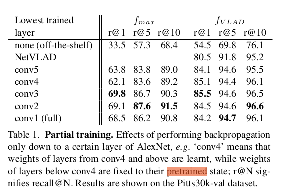</figure>

<figure style="text-align:center;">  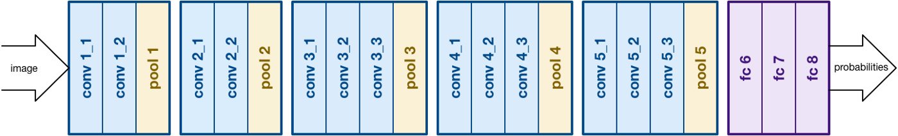</figure>
위의 네트워크 구조에서 뒤에 있는conv5와 관련된 부분이 fix된다. 논문의 테이블에선 그 이유를 재현성을 기준으로 선정했음을 말하고 있다.   
<br>
<br>

- `if opt.mode.lower() == 'cluster' and not opt.vladv2: layers.append(L2Norm())`  
  cluster 모드거나 vladv2를 사용하지 않는다면 L2Norm() 레이어를 추가한다. 이 부분은 Vlad Layer에서 다시 설명한다. 

- `encoder = nn.Sequential(*layers)`  
`model = nn.Module()`  
`model.add_module('encoder', encoder)`   
지금까지 설정된 layer들을 이어붙여 model로 모듈화한다. 

CNN의 구성은 여기까지이다. 
이후 vlad layer를 완성하여 붙여야만 전체 네트워크가 완성된다. 
논문에선 비교실험을 위해 Max-pooling도 사용한다. 참고하자. 


## 3. VLAD Layer

<figure style="text-align:center;">  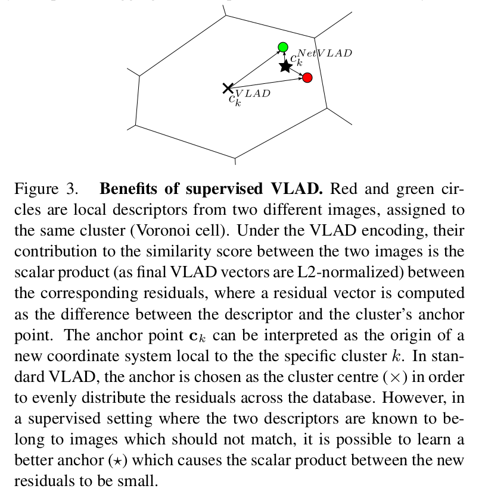</figure>

우선 VLAD에 대해 이해해보자. 
<figure style="text-align:center;">  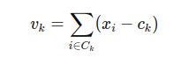</figure>
<figure style="text-align:center;">  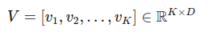</figure>

1) VLAD Desciptor는 여러개의 Local desciptor들을 놓고, 
2) k개의 cluster를 나누어, 각 cluster의 중심점(k-means의 중심점) 에 c_k VLAD를 정의
3) 각각의 local desctriptor와 c_k VLAD간의 잔차(residual)의 합을 vector로 저장하고
4) 이 k개의 vector들을 이미지간 비교하여 유사한 이미지를 찾아내는 global descriptor로 사용한다. 
<figure style="text-align:center;">  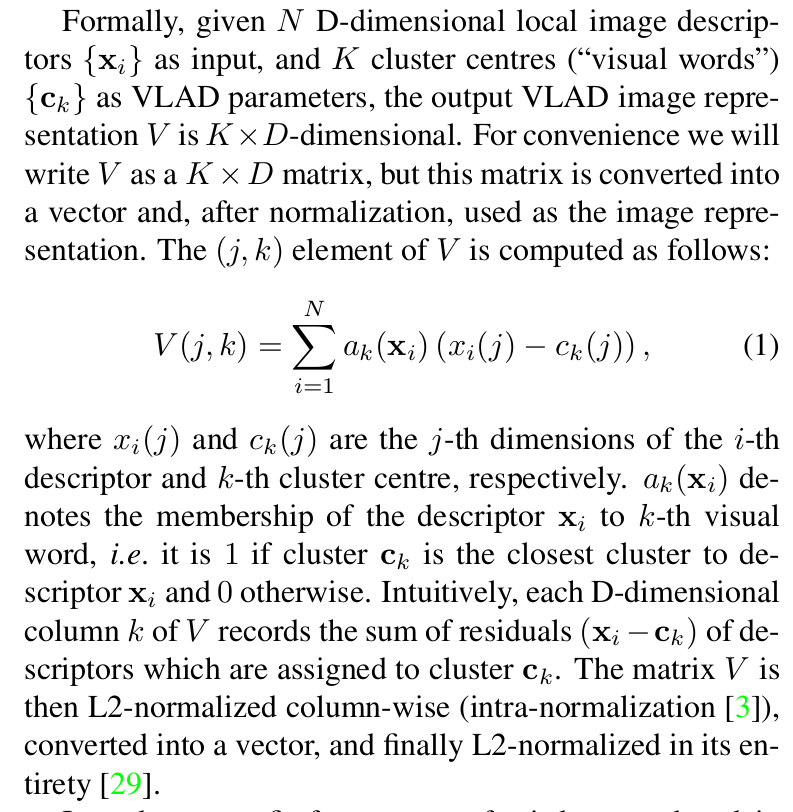</figure>

단순히 VLAD descriptor만 추가하게 될 경우, 이는 Hard-assignment가 되며, 미분 가능한 형태가 아니다. 이를 미분할 수 있게, 가중치 `a`를 다음과 같이 정의하여 Soft Assignmet가 될수 있게 바꾼다. 이 과정을 통해 VLAD Network는 미분이 가능해지며, 학습이 가능해진다. 
<figure style="text-align:center;">  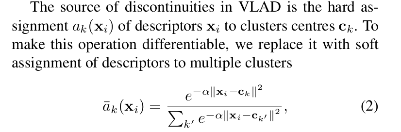</figure>

2번 수식을 3번 수식으로 변형하여 얻은 최종 netVLAD 는 다음과 같다. 
<figure style="text-align:center;">  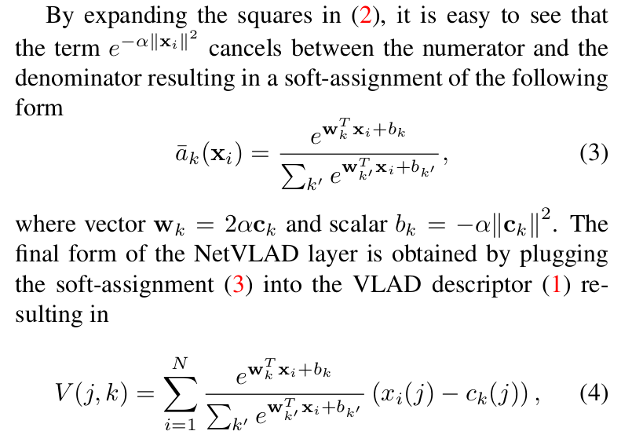</figure>

이를 통해 학습가능한(미분 가능한)함수로 바뀐다고 이야기하고 있다. 
도해적으로 설명은 가능하나, 수학적으로 엄밀한지는 명확하게 설명하긴 어렵다. 

“이 feature를 어느 cluster에, 얼마나 기여시킬까?” → softmax weight
descriptor가 어느 cluster에 속하는가에 따라 cluster의 위치가 급격하게 바뀌는 Hard-assign형태에서, 거리가 멀면 영향도를 낮추는 방식으로 cluster의 변화를 줄여 점진적인 변화가 가능하게 한다. 도해적으로 이해할땐 이 방식이 다소 수월하다. 

다만 유사한 형태로 이야기하자면, SoftMax함수의 가중치 x Activation 함수 의 형태를 보이며,   
이후 Residual Attention이라는 유사한 형태를 다루는 논문도 찾을수는 있다. 

<figure style="text-align:center;">  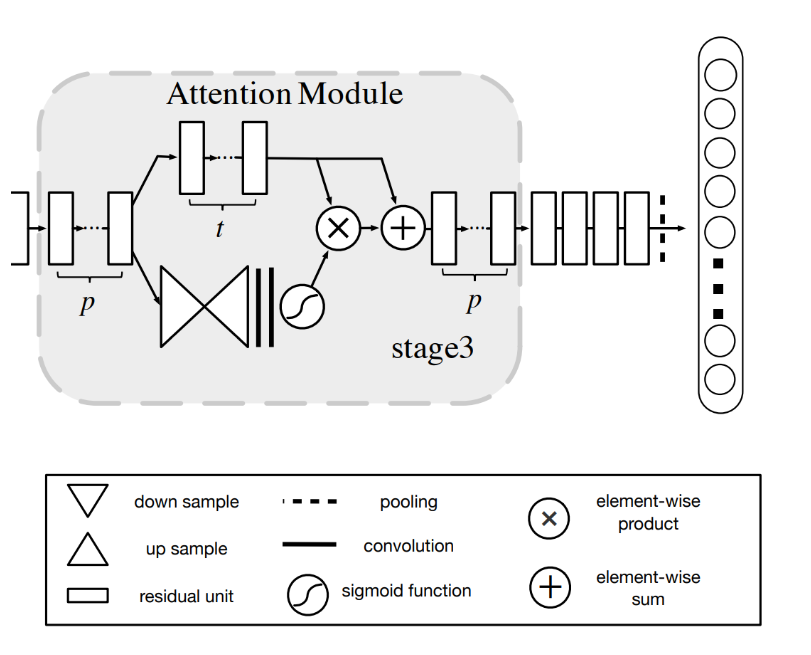</figure>

https://arxiv.org/pdf/1611.05431.pdf  
https://velog.io/@jj770206/Residual-Attention-Network-for-Image-Classification-2017

어쨋든, 이걸 Python에선 어떻게 구현하는지 찾아보자. 
(현 시점에서 MATLab 코드는 분석이 어려워 잠시 미뤄둔다.)
<br>
<br>
<br>

### Cluster의 계산

VLAD Vector의 연산에 있어, 수식 (4)의 C_k에 해당하는 cluster point들을 구해야 한다. 
따라서, VLAD_Layer의 구성에서 제일 먼저 수행하는 부분은 Cluster모드로 main.py를 돌리는 것이다. 

```bash
    python main.py --mode=cluster --arch=vgg16 --pooling=netvlad --num_clusters=64
```

cluster모드일때 main.py에서 실행되는 코드는 아래와 같다. 

```python
(__main__ 내부)
    elif opt.mode.lower() == 'cluster':
        whole_train_set = dataset.get_whole_training_set(onlyDB=True)

    (CNN layer 구성 중)

    if opt.mode.lower() == 'cluster' and not opt.vladv2:
       layers.append(L2Norm())
    (이후 Encoder module 확정하고 model.add함)

    (다른 mode들의 동작, train, test 등)

    elif opt.mode.lower() == 'cluster':
        print('===> Calculating descriptors and clusters')
        get_clusters(whole_train_set)


```
cluster를 구하고 저장하는 함수는 다음과 같이 정의되어있다. 

```python

def get_clusters(cluster_set):
    nDescriptors = 50000
    nPerImage = 100
    nIm = ceil(nDescriptors/nPerImage)

    sampler = SubsetRandomSampler(np.random.choice(len(cluster_set), nIm, replace=False))
    data_loader = DataLoader(dataset=cluster_set, 
                num_workers=opt.threads, batch_size=opt.cacheBatchSize, shuffle=False, 
                pin_memory=cuda,
                sampler=sampler)

    if not exists(join(opt.dataPath, 'centroids')):
        makedirs(join(opt.dataPath, 'centroids'))

    initcache = join(opt.dataPath, 'centroids', opt.arch + '_' + cluster_set.dataset + '_' + str(opt.num_clusters) + '_desc_cen.hdf5')
    with h5py.File(initcache, mode='w') as h5: 
        with torch.no_grad():
            model.eval()
            print('====> Extracting Descriptors')
            dbFeat = h5.create_dataset("descriptors", 
                        [nDescriptors, encoder_dim], 
                        dtype=np.float32)

            for iteration, (input, indices) in enumerate(data_loader, 1):
                input = input.to(device)
                image_descriptors = model.encoder(input).view(input.size(0), encoder_dim, -1).permute(0, 2, 1)

                batchix = (iteration-1)*opt.cacheBatchSize*nPerImage
                for ix in range(image_descriptors.size(0)):
                    # sample different location for each image in batch
                    sample = np.random.choice(image_descriptors.size(1), nPerImage, replace=False)
                    startix = batchix + ix*nPerImage
                    dbFeat[startix:startix+nPerImage, :] = image_descriptors[ix, sample, :].detach().cpu().numpy()

                if iteration % 50 == 0 or len(data_loader) <= 10:
                    print("==> Batch ({}/{})".format(iteration, 
                        ceil(nIm/opt.cacheBatchSize)), flush=True)
                del input, image_descriptors
        
        print('====> Clustering..')
        niter = 100
        kmeans = faiss.Kmeans(encoder_dim, opt.num_clusters, niter=niter, verbose=False)
        kmeans.train(dbFeat[...])

        print('====> Storing centroids', kmeans.centroids.shape)
        h5.create_dataset('centroids', data=kmeans.centroids)
        print('====> Done!')
```

## VLAD Network의 구성


이렇게 구성한 다음, CNN module에 추가함으로써, NetVLAD model이 완성된다. 

```python
if opt.mode.lower() != 'cluster':  #train이나 test인 경우를 말한다. 
        if opt.pooling.lower() == 'netvlad':
            #NetVLAD Layer block을 가져온다. 
            net_vlad = netvlad.NetVLAD(num_clusters=opt.num_clusters, dim=encoder_dim, vladv2=opt.vladv2)
            
            if not opt.resume: 
                if opt.mode.lower() == 'train':
                    initcache = join(opt.dataPath, 'centroids', opt.arch + '_' + train_set.dataset + '_' + str(opt.num_clusters) +'_desc_cen.hdf5')
                else:
                    initcache = join(opt.dataPath, 'centroids', opt.arch + '_' + whole_test_set.dataset + '_' + str(opt.num_clusters) +'_desc_cen.hdf5')

                if not exists(initcache):
                    raise FileNotFoundError('Could not find clusters, please run with --mode=cluster before proceeding')

                with h5py.File(initcache, mode='r') as h5: 
                    clsts = h5.get("centroids")[...]
                    traindescs = h5.get("descriptors")[...]
                    net_vlad.init_params(clsts, traindescs) 
                    del clsts, traindescs
            
            #pooling 단계에 net_vlad layer가 들어간다. 
            model.add_module('pool', net_vlad)
        #이하는 만약 VLAD Layer를 쓰지 않을 경우 진입하는 코드. for Abalation
        elif opt.pooling.lower() == 'max':
            global_pool = nn.AdaptiveMaxPool2d((1,1))
            model.add_module('pool', nn.Sequential(*[global_pool, Flatten(), L2Norm()]))
        elif opt.pooling.lower() == 'avg':
            global_pool = nn.AdaptiveAvgPool2d((1,1))
            model.add_module('pool', nn.Sequential(*[global_pool, Flatten(), L2Norm()]))
        else:
            raise ValueError('Unknown pooling type: ' + opt.pooling)

```

이제 netVLAD.py에서 어떻게 pooling layer 를 구성하는가 보자. 

```python
import torch
import torch.nn as nn
import torch.nn.functional as F
from sklearn.neighbors import NearestNeighbors
import numpy as np

# based on https://github.com/lyakaap/NetVLAD-pytorch/blob/master/netvlad.py
class NetVLAD(nn.Module):
    """NetVLAD layer implementation"""

    def __init__(self, num_clusters=64, dim=128, 
                 normalize_input=True, vladv2=False):
        """
        Args:
            num_clusters : int
                The number of clusters
            dim : int
                Dimension of descriptors
            alpha : float
                Parameter of initialization. Larger value is harder assignment.
            normalize_input : bool
                If true, descriptor-wise L2 normalization is applied to input.
            vladv2 : bool
                If true, use vladv2 otherwise use vladv1
        """
        super(NetVLAD, self).__init__()
        self.num_clusters = num_clusters
        self.dim = dim
        self.alpha = 0
        self.vladv2 = vladv2
        self.normalize_input = normalize_input
        self.conv = nn.Conv2d(dim, num_clusters, kernel_size=(1, 1), bias=vladv2)
        self.centroids = nn.Parameter(torch.rand(num_clusters, dim))

    def init_params(self, clsts, traindescs):
        #TODO replace numpy ops with pytorch ops
        if self.vladv2 == False:
            clstsAssign = clsts / np.linalg.norm(clsts, axis=1, keepdims=True)
            dots = np.dot(clstsAssign, traindescs.T)
            dots.sort(0)
            dots = dots[::-1, :] # sort, descending

            self.alpha = (-np.log(0.01) / np.mean(dots[0,:] - dots[1,:])).item()
            self.centroids = nn.Parameter(torch.from_numpy(clsts))
            self.conv.weight = nn.Parameter(torch.from_numpy(self.alpha*clstsAssign).unsqueeze(2).unsqueeze(3))
            self.conv.bias = None
        else:
            knn = NearestNeighbors(n_jobs=-1) 
            knn.fit(traindescs)
            del traindescs
            dsSq = np.square(knn.kneighbors(clsts, 2)[1])
            del knn
            self.alpha = (-np.log(0.01) / np.mean(dsSq[:,1] - dsSq[:,0])).item()
            self.centroids = nn.Parameter(torch.from_numpy(clsts))
            del clsts, dsSq

            self.conv.weight = nn.Parameter(
                (2.0 * self.alpha * self.centroids).unsqueeze(-1).unsqueeze(-1)
            )
            self.conv.bias = nn.Parameter(
                - self.alpha * self.centroids.norm(dim=1)
            )

    def forward(self, x):
        N, C = x.shape[:2]

        if self.normalize_input:
            x = F.normalize(x, p=2, dim=1)  # across descriptor dim

        # soft-assignment
        soft_assign = self.conv(x).view(N, self.num_clusters, -1)
        soft_assign = F.softmax(soft_assign, dim=1)

        x_flatten = x.view(N, C, -1)
        
        # calculate residuals to each clusters
        vlad = torch.zeros([N, self.num_clusters, C], dtype=x.dtype, layout=x.layout, device=x.device)
        for C in range(self.num_clusters): # slower than non-looped, but lower memory usage 
            residual = x_flatten.unsqueeze(0).permute(1, 0, 2, 3) - \
                    self.centroids[C:C+1, :].expand(x_flatten.size(-1), -1, -1).permute(1, 2, 0).unsqueeze(0)
            residual *= soft_assign[:,C:C+1,:].unsqueeze(2)
            vlad[:,C:C+1,:] = residual.sum(dim=-1)

        vlad = F.normalize(vlad, p=2, dim=2)  # intra-normalization
        vlad = vlad.view(x.size(0), -1)  # flatten
        vlad = F.normalize(vlad, p=2, dim=1)  # L2 normalize

        return vlad

```


- `__init__(num_clusters, dim, normalize_input=True, vladv2=False)`  
  - num_clusters: VLAD의 cluster 개수 K
  - dim: local descriptor 차원 D (= encoder_dim)
  - normalize_input: 입력 descriptor를 L2 normalize 할지 여부
  - vladv2: v1/v2 초기화 방식 분기

- `self.conv = nn.Conv2d(dim, num_clusters, kernel_size=1, bias=vladv2)`  
  - 1×1 conv = local descriptor에 대한 “cluster별 점수(score)” 계산기
  - 입력 (N, D, H, W) → 출력 (N, K, H, W)
  - bias를 vladv2에서만 켜는 이유는 vladv2식에서 bias 항이 필요해서.

- `self.centroids = nn.Parameter(torch.rand(num_clusters, dim))`
  - cluster center $c_k$ 를 학습 가능한 파라미터로 둠
  - 초기값은 랜덤이지만, 보통 init_params()에서 k-means 결과로 덮어씀.

- `init_params(clsts, traindescs)`  
  NetVLAD를 “cluster 결과(k-means)”로 초기화하는 함수.
  - clsts: k-means centroids, shape (K, D)
  - traindescs: 샘플 descriptor들, shape (Ndesc, D)

- `if self.vladv2 == False:` (vladv1 초기화)
  - `clstsAssign = clsts / ||clsts||` centroid를 단위벡터로 normalize
  - `dots = clstsAssign · traindescs^T` centroid와 descriptor의 dot product 계산
  - `alpha = -log(0.01) / mean(dots[0]-dots[1])`   
     - soft assignment가 얼마나 “hard”해질지(temperature) 를 데이터 기반으로 결정
  - `self.centroids = clsts` centroid를 파라미터로 세팅
  - `self.conv.weight = alpha * clstsAssign`
    - conv weight를 centroid 방향으로 초기화 → 결과적으로 score가 “거리 기반”처럼 동작하게 됨
    - self.conv.bias = None vladv1은 bias 없이 사용

- `else: `(vladv2 초기화)  
NearestNeighbors로 centroid 주변 2개 이웃 거리 기반으로 alpha 추정
  - `self.conv.weight = 2α c_k`
  - `self.conv.bias = -α ||c_k||`

- `forward(self, x)` 입력 feature map을 VLAD vector로 pooling하는 핵심 함수.
  - 입력 x shape: (N, C, H, W)
  - 여기서 C가 dim(=encoder_dim)과 같아야 함.

- `if self.normalize_input: x = F.normalize(x, p=2, dim=1)`  
local descriptor를 채널축(dim=1) 기준으로 L2 normalize  
즉, 각 위치의 descriptor $x_i​$ 를 단위벡터로 만듦.

- `soft_assign = self.conv(x).view(N, K, -1)`  
1×1 conv로 cluster별 score 생성  
(N, K, H, W) → (N, K, H*W) 로 펼침

- `soft_assign = F.softmax(soft_assign, dim=1)`  
cluster 축(K) 방향으로 softmax  
각 spatial 위치마다 K개 cluster에 대한 확률(가중치) 생성

- `vlad = torch.zeros([N, K, C], ...)`  
cluster별 누적 residual을 담을 버퍼  
최종적으로 (N, K, C) = cluster마다 C차원 벡터가 생김.  

- `for C in range(self.num_clusters):`  
  “cluster index k” 
  - `residual = x_flatten - centroid_k` 
    각 위치 descriptor에서 centroid를 뺀 residual 
  - `residual *= soft_assign[:, k, :]`  residual에 soft assignment 가중치를 곱함  
    즉, “이 위치가 cluster k에 기여하는 정도”로 residual을 스케일링.

  - `vlad[:, k, :] = residual.sum(dim=-1)` cluster k의 VLAD 벡터 생성


- `vlad = F.normalize(vlad, p=2, dim=2)`
- `vlad = vlad.view(N, -1)`  (N, K, C) → (N, K*C) 로 flatten
- `vlad = F.normalize(vlad, p=2, dim=1)` 다시 L2 normalize


출력 shape: (N, K*dim)  
예: dim=512, K=64 → 32768차원
